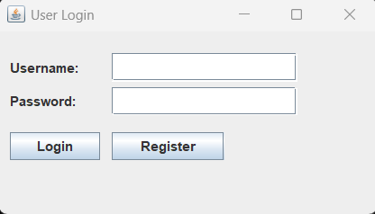
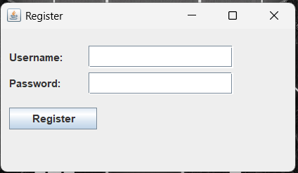

# Java User Authentication System

A simple Java desktop application that supports user login and registration using:

- Java Swing GUI
- JDBC (SQLite/MySQL)
- Password hashing with BCrypt

## Features

- User registration
- Secure login
- Password hashing with JBCrypt
- GUI built with Swing

## Getting Started

1. Clone the repository:
   ```bash
   git clone https://github.com/your-username/your-repo-name.git

## Screenshots

### 🔐 Login Form


### 📝 Register Form

